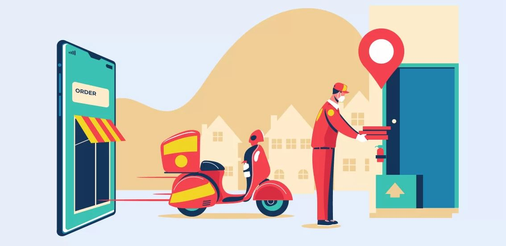
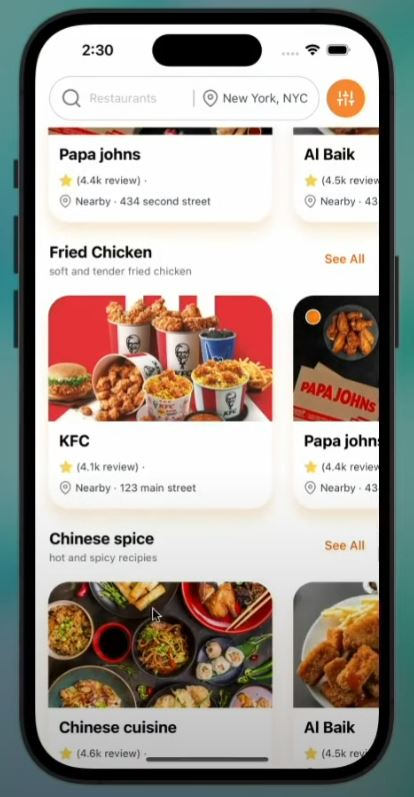
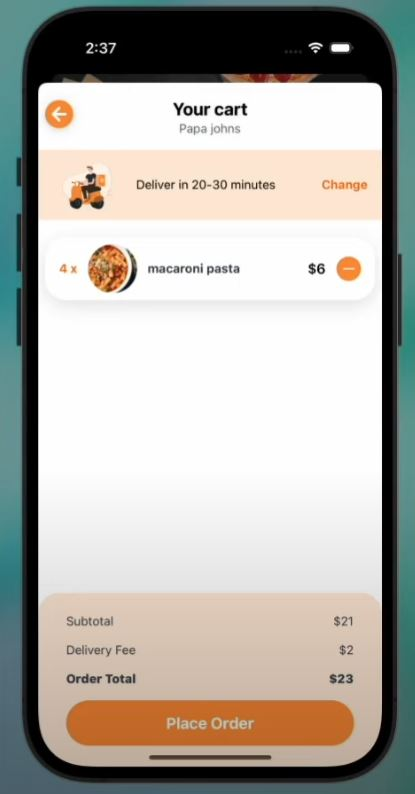
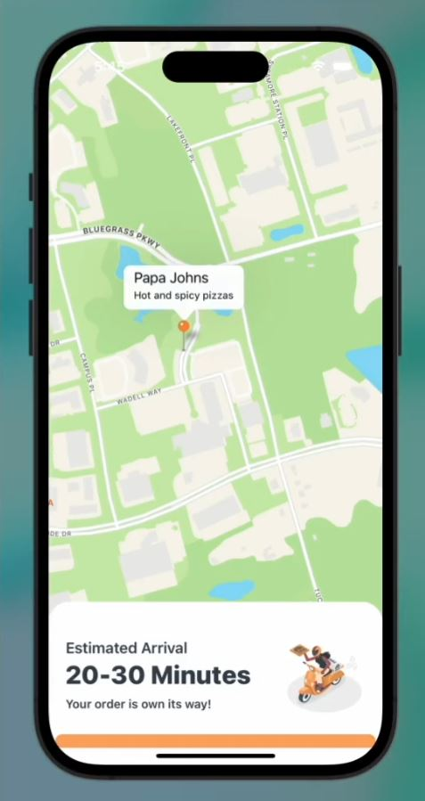
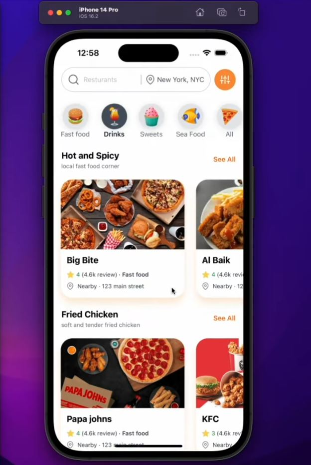
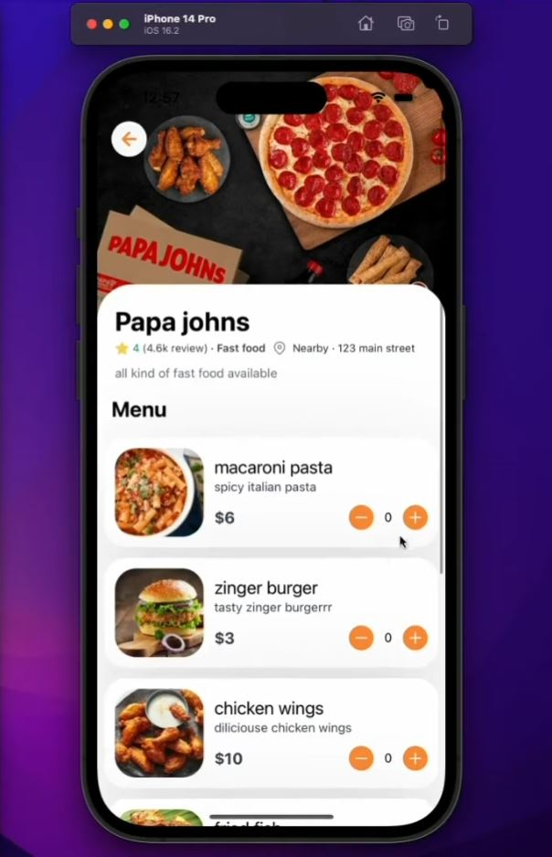
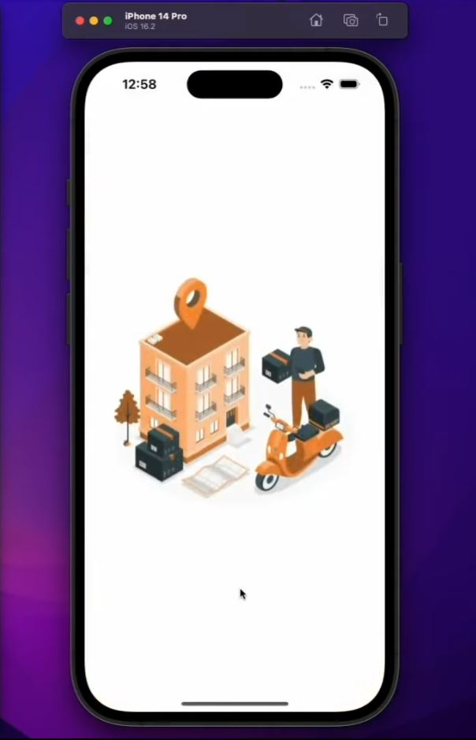

# CraveExpress

🍔 Fast Delivery with a Culinary Adventure at Your Doorstep!

<!-- 
 -->

<!-- 
 -->

Are you tired of the same old takeout options? CraveExpress is here to change the game! We offer more than just fast food delivery – we bring you a culinary adventure that will tantalize your taste buds. Imagine exploring a world of flavors without leaving your home, with dishes carefully crafted by renowned chefs.

Whether you're craving a juicy burger, authentic Italian pasta, or spicy Asian delicacies, CraveExpress has got you covered. With our seamless ordering process and lightning-fast delivery, you can enjoy a restaurant-quality meal in the comfort of your own space. Embrace the delicious possibilities with CraveExpress and let your cravings take flight!

  

🌟 Wide Variety: Explore a diverse range of culinary options from our extensive network of partner restaurants. From 🍔 burgers to 🍣 sushi and everything in between, we have something to satisfy every craving.

⚡ Fast Delivery: Experience lightning-fast delivery right to your doorstep. We prioritize speed without compromising on the quality and freshness of your meal.

🌍 Global Flavors: Embark on a culinary adventure with our selection of international cuisines. Discover the rich and authentic tastes of 🌮 Mexico, 🍝 Italy, 🍣 Japan, and more, all conveniently available through CraveExpress.

  
  

🔍 Easy Ordering: Our user-friendly platform makes ordering a breeze. With just a few clicks, you can browse menus, customize your meal, and place your order hassle-free.

🌟 Curated Restaurants: We partner with top-notch restaurants and talented chefs, ensuring that every meal is a masterpiece. Enjoy the expertise of culinary artisans from renowned establishments.

🚀 Continuous Innovation: We're committed to enhancing your food delivery experience. Through constant innovation and technological advancements, we strive to provide you with the best possible service.

😊 Customer Satisfaction: Your satisfaction is our top priority. We go the extra mile to ensure that every aspect of your CraveExpress experience exceeds your expectations, leaving you with a smile on your face.

  
  

## Downloading the app

To install the application to your own system:

- `cmd` within the folder path to open a desired location to save

- `git clone https://github.com/JoexTitan/Food-Delivery-App.git`

- `npm install` -> `npm run build` -> `npm start`

  
  
  

